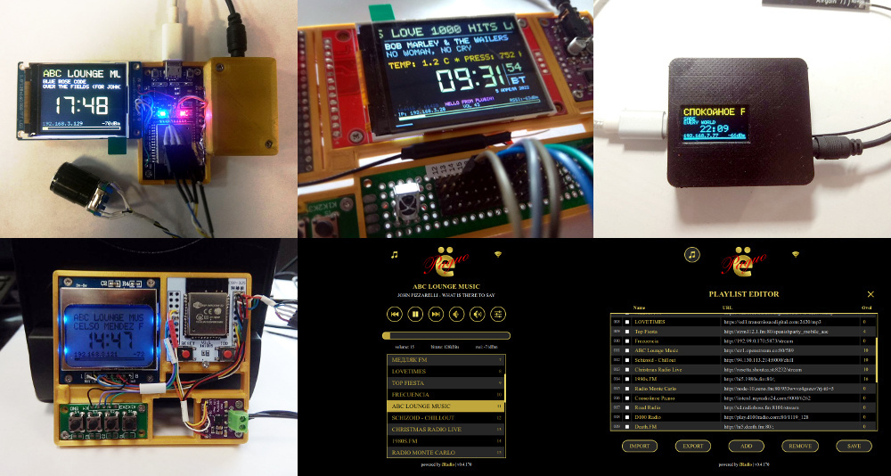

# ёRadio


##### Web-radio based on [ESP32-audioI2S](https://github.com/schreibfaul1/ESP32-audioI2S) library

##### More images in [Images.md](Images.md)
### Hardware
#### Required:
**ESP32 board**: https://aliexpress.ru/item/32847027609.html \
**I2S DAC**, roughly like this one: https://aliexpress.ru/item/1005001993192815.html \
https://aliexpress.ru/item/1005002011542576.html
#### Optional:
##### Displays
- **ST7735** 1.8' or 1.44' https://aliexpress.ru/item/1005002822797745.html
- or **SSD1306** 0.96' I2C https://aliexpress.ru/item/1005001621806398.html
- or **Nokia5110** 84x48 SPI https://aliexpress.ru/item/1005001621837569.htmlz

##### Controls
Three tact buttons or Encoder or all together
### Connection table
| SPI Display | ESP-32 | options.h |
| ------ | ------ | ------ |
| GND | GND | - |
| VCC | +5v | - |
| SCL | 18 | - |
| SDA | 23 | - |
| CSL | 5* | TFT_CS |
| RSTL | 15* | TFT_RST |
| DCL | 4* | TFT_DC |

| I2C Display | ESP-32 | options.h |
| ------ | ------ | ------ |
| GND | GND | - |
| VCC | +5v | - |
| SDA | 13* | I2C_SDA |
| SCL | 14* | I2C_SCL |

| I2S DAC | ESP-32 | options.h |
| ------ | ------ | ------ |
| GND       | GND | - |
| VIN       | +5v | - |
| DOUT(DIN) | 27* | I2S_DOUT |
| BCLK      | 26* | I2S_BCLK |
| LRC(WSEL) | 25* | I2S_LRC |

| Buttons, Encoder | ESP-32 | options.h |
| ------ | ------ | ------ |
| GND       | GND | - |
| PIN       | * | ENC_BTNx, BTN_xxx  |

_\* Any free pin, configured in options.h_
### Dependencies
#### Libraries:
Adafruit_GFX, Adafruit_ST7735\*, Adafruit_SSD1306\*, Adafruit_PCD8544\*, (\* depending on display model), ESP32Encoder, OneButton, [ESPAsyncWebServer](https://github.com/me-no-dev/ESPAsyncWebServer), [AsyncTCP](https://github.com/me-no-dev/AsyncTCP)
#### Tool:
[ESP32 Filesystem Uploader](https://randomnerdtutorials.com/install-esp32-filesystem-uploader-arduino-ide/)
## Hardware setup
Hardware is connected in the **[options.h](yoRadio/options.h)** file. \
_so that the settings are not overwritten when updating git, you need to put the file **myoptions.h** ([exsample](exsamples/myoptions.h)) in the root of the project and make settings in it_
````
/* DISPLAY MODEL
 * 0 - DUMMY
 * 1 - ST7735
 * 2 - SSD1306
 * 3 - NOKIA5110
 */
#define DSP_MODEL  1
````
The ST7735 display model is configured in the file [src/displays/displayST7735.cpp](yoRadio/src/displays/displayST7735.cpp)
````
#define DTYPE INITR_BLACKTAB // 1.8' https://aliexpress.ru/item/1005002822797745.html
//#define DTYPE INITR_144GREENTAB // 1.44' https://aliexpress.ru/item/1005002822797745.html
````
Rotation of the ST7735 display is configured in the file [src/displays/displayST7735.h](yoRadio/src/displays/displayST7735.h)
````
#define TFT_ROTATE 3 // 180 degress
````

## Quick start
1. In ArduinoIDE - upload sketch data (Tools→ESP32 Sketch Data Upload)
2. Upload the sketch to the board ([example of the board connection](images/board.jpg))
3. Connect to yoRadioAP acces point with password 12345987, go to http://192.168.4.1/ configure and wifi connections.  \
_\*this step can be skipped if you add WiFiSSID WiFiPassord pairs to the [yoRadio/data/data/wifi.csv](yoRadio/data/data/wifi.csv) file (tab-separated values, one line per access point) before uploading the sketch data in step 1_
4. After successful connection go to http://\<ipaddress\>/ , add stations to playlist (or import WebStations.txt from KaRadio)
5. Well done!

## More features
- Сan add up to 65535 stations to a playlist. Supports and imports [KaRadio](https://github.com/karawin/Ka-Radio32) playlists (WebStations.txt)
- Telnet with KaRadio format output \
 **Commands**: \
cli.prev (or simply prev) - previous station \
cli.next, next - next station \
cli.toggle, toggle - start/stop \
cli.stop, stop - stop \
cli.start, start, cli.play, play - start playing \
cli.play("x"), play(x), play x - play station x \
cli.vol, vol - the current value of volume (0-254) \
cli.vol("x"), vol(x), vol x - set volume (0-254) \
cli.audioinfo, audioinfo - the current value of debug (0-1) \
cli.audioinfo("x"), audioinfo(x), audioinfo x - debug on/off (0-1) \
cli.smartstart, smartstart - the current value of smart start
cli.smartstart("x"), smartstart(x), smartstart x - smart start: 2-off, 0-1 - start playing on boot, if the radio was playing before the reboot \
cli.list, list - get playlist \
cli.info, info - get current state \
sys.boot, boot, reboot - reboot \
sys.date - date/time

## Version history
### v0.4.197
- added support for Nokia 5110 SPI displays
- some bugs fixes

### v0.4.183
- ovol reading bug

### v0.4.182
- display connection algorithm changed
- added support for myoptions.h file for custom settings

### v0.4.180
- vol steps 0..256 (in ESP32-audioI2S)

### v0.4.177
- added support for SSD1306 I2C displays
- fixed broken buttons.
